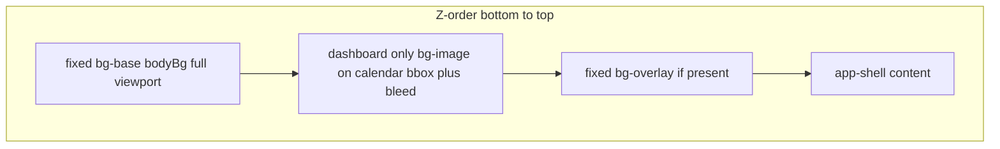

# Full-screen background + dashboard-only bgImage

## Decisions already captured (from you)

- **Base layer:** One color, full screen, everywhere (via existing `bodyBg` / `--body-bg`).
- **bgImage:** On top of base; **dashboard routes only** (not portal/auth/other layouts using `BackgroundLayout`).
- **Rollout:** Base + dashboard-local bgImage in one delivery.

## Locked: calendar + bleed only (v1), easy to extend later (2026-04-11)

- **Scope of `bgImage` on the dashboard:** The painted area matches the **calendar’s layout box** (the [`BookingCalendar`](src/components/booking/booking-calendar.tsx) region as wrapped in [`dashboard-content.tsx`](src/components/layout/dashboard-content.tsx)), **plus a small uniform bleed** outside that box (padding or equivalent). It does **not** need to fill the full [`DashboardPageFrame`](src/components/layout/dashboard-page-frame.tsx) width unless the calendar already does.

- **Future change:** Keep the implementation **localized** (e.g. one wrapper component + optional CSS variables for bleed / max expansion) so you can later widen the layer to the **whole content column**, full viewport stripe, or include adjacent chrome (e.g. quick-book rail) **without** reshaping Convex theme JSON—only layout/CSS.

- **Edge case:** If organizer layout places **QuickBookRail** beside or above the calendar, decide in implementation whether bleed wraps **calendar only** (v1 default) or calendar+rail; document in code comment for the next iteration.

## Locked decisions (overlay + naming interview, 2026-04-11)

| Pt | Choice | Notes |
|----|--------|--------|
| 1 | **Approve** default mental model | `bodyBg` = full-screen base; `bgImage` = decorative media (dashboard band); `bgOverlay` = readability tint above image, below shell. |
| 2 | **A** | **Implement** the missing layer: add `
` (or equivalent) **everywhere** the background stack applies (same places as base / image band), so `--bg-overlay` actually paints. |
| 3 | **Approve** | Keep **e2e smoke** asserting `.bg-overlay` exists once the DOM matches (align test with implementation, not delete assertion). |
| 4 | **Approve** default | **`bgOverlay` remains full-viewport** (fixed, `inset: 0`) above base + band — simplest, consistent glass contrast; revisit band-only overlay only if photos look too washed out. |

## Calendar bounding box + bleed (v1) — supersedes earlier “full column width” wording

**v1 (locked):**

- The `bgImage` layer is sized to the **calendar component’s box** (width and height as laid out), **plus bleed**—not the entire `max-w-4xl` page column unless the calendar already spans that width.
- **Height** tracks the calendar: weeks / expand UI changes **resize** the painted area (Behavior A). **Bleed** is extra margin around that box so `cover` crops less harshly at the grid edge.

**Future (explicitly easy):** Widen the wrapper to full column, add `min-h`, or include more dashboard chrome—**layout-only** changes; keep theme tokens as `--bg-image` / `--bg-position` / `--bg-size` on the band.

**Reasoning:**

- Matches “photo hugs the calendar” and keeps landscape/portrait decisions localized to a **small** rect.
- **Evolvability:** Isolate a `DashboardCalendarBackdrop` (name TBD) + `--dashboard-bg-bleed` or Tailwind `p-*` so one edit changes scope later.

## Gaps, risks, and repo comments

1. **`.bg-overlay` vs DOM:** [`design-system/MASTER.md`](design-system/MASTER.md) requires a fixed `.bg-overlay` layer; [`e2e/smoke.spec.ts`](e2e/smoke.spec.ts) asserts `.bg-overlay` exists. **No layout in `src/app` currently renders `className="bg-overlay"`** (grep shows only CSS + docs). That is either **broken smoke** or **stale docs** — this work should **reconcile** (add the node everywhere the stack applies, or update MASTER + smoke intentionally).

2. **Theme vars unused on non-dashboard:** `ThemeProvider` can keep injecting `--bg-image` globally; only **dashboard** mounts a node that uses it. Alternatively, inject `--bg-image` only on dashboard — more coupling, slightly cleaner CSS. Default: **keep global injection** (simpler).

3. **`cookie-cutter-title`** ([`globals-surfaces.css`](src/app/globals-surfaces.css)) uses `var(--bg-image)` for knockout text — if bgImage is dashboard-only, **either** restrict that utility to dashboard **or** give it a fallback (e.g. `--body-bg` or none). Low usage risk if unused in components.

4. **Pitch-black / gradient work** (older plan in `pitch_black_dark_backgrounds_beef4c97.plan.md`): Once bgImage is **not** full-screen, dark “base” color is the main full-screen look; **gradient vs `#000`** for `bgImage` becomes a smaller surface. Reconcile or supersede that plan when implementing.

## Responsiveness and “calendar changes”

### Is bgImage responsive today?

**Today:** `--bg-image` is on a **fixed, full-viewport** `.bg-image` with `background-size: var(--bg-size, cover)` — responsive only in the sense of **covering the whole screen** at any viewport, not tied to the calendar.

**Target (v1):** The image layer **inherits the calendar’s responsive width** (whatever the calendar uses at each breakpoint), plus bleed—no separate “band wider than calendar” unless you widen the wrapper later.

### Recommendation: band slightly larger than the calendar vs exact match

**Slightly larger (padding)** is usually easier and looks better:

- Photos of **different aspect ratios** crop more predictably if the visible box is not flush with the grid lines.
- Implement as an inner wrapper: `relative` container around the calendar with **`p-*` or negative margin band** so `background-image` sits on a layer that extends **a few px beyond** the grid (your “little bit more”).

### Mixed-resolution photos

Avoid relying on one pixel size. Standard pattern:

- `background-image: var(--bg-image)` (typically `url(...)`).
- `background-size: cover` (or `contain` if you must never crop — usually too weak for hero bands).
- `background-position: center` (or theme token later).
- Optional `min-height` on the band so short calendars still show enough photo.

Small images **upscale** and look soft; document a **minimum recommended resolution** in MASTER or internal notes (not a code invariant unless you add runtime checks).

### Landscape photos (wide shots) in a narrow/tall band

The dashboard band is **roughly column-shaped** (often **taller than it is wide** on phone). A **landscape** asset (width > height) in a box like that, with the default **`background-size: cover`**, still **fills** the box: the browser scales the image until the box is covered, then **crops** what does not fit.

- **Typical result:** you keep the **vertical** center of the frame and lose a lot of the **left and right** of the photo (or top/bottom if the box is unexpectedly wide). The subject must “live” in the **safe center** or you adjust **focal point**.
- **Mitigations (later or v1):** `background-position` (e.g. `center top` for horizons, `center` for symmetry), optional **per-theme** `--bg-position` (already supported on the current full-screen `.bg-image` pattern in [`theme-types`](src/themes/theme-types.ts)); **`contain`** instead of `cover` avoids cropping but can show **letterboxing** (empty bands showing `bodyBg`) — usually weaker for a “hero” band.
- **Practical guidance:** For landscape stock, pick shots where the **important content is in the middle third** vertically, or crop the asset to a **taller aspect** before upload so `cover` does not throw away the subject.

### How the image “changes” when the calendar changes (height)

Two different products:

| Behavior | Effect |
|----------|--------|
| **A — Track calendar height** | Band is **behind the calendar block only** (e.g. `absolute inset-0 -z-10` inside a `relative` wrapper that wraps the calendar). When weeks / expand-collapse change, **the painted area grows or shrinks** with content. |
| **B — Full viewport height in the column** | Band is a **tall stripe** (`min-h-screen` / `min-h-[100dvh]`) inside the max-width column; calendar scrolls over it. Width tracks breakpoints; **height does not** track week count. |

**Matt v1 lock:** **Behavior A** + **bleed**—calendar-sized box, not a full-column min-height stripe. **B** remains a future layout-only option.

**Recommendation (still valid for later):** Use **B** only if you want a **stable vertical photo** regardless of month length.

## Implementation sketch (for execution phase)

- **Non-dashboard layouts** ([`portal/layout.tsx`](src/app/(portal)/layout.tsx), [`auth/layout.tsx`](src/app/(auth)/layout.tsx), [`background-layout.tsx`](src/components/layout/background-layout.tsx)): render **base only** (replace current single `.bg-image` that mixes color + image).
- **Dashboard:** Prefer implementing the image on a **wrapper in [`dashboard-content.tsx`](src/components/layout/dashboard-content.tsx)** (or a small presentational component) around **`BookingCalendar`**, not only in [`dashboard-shell.tsx`](src/app/(dashboard)/dashboard-shell.tsx)), so the layer tracks **calendar** size. Shell still provides base + overlay + `app-shell`.
- **CSS:** Base has **no** `background-image`; calendar backdrop uses `--bg-image` (+ optional `--bg-size` / `--bg-position`); **absent** off-dashboard.

## Open product choice (resolved)

- **Overlay:** **Full-screen** tint (see locked decisions). Band-only overlay deferred unless QA shows photos are too muted.

---

## bgImage vs bgOverlay (definitions)

- **`bgImage`:** Theme token for **decorative background media** (gradient or `url(...)`). Maps to `--bg-image`; v1 paints on a **dashboard-only** layer sized to **calendar + bleed** (today’s full-screen `.bg-image` global layer is superseded by this plan).
- **`bgOverlay`:** Theme token for a **readability / mood tint** (usually a radial gradient) **above** the image, **below** `.app-shell`. Maps to `--bg-overlay`; intended to paint on `.bg-overlay` (fixed, `pointer-events: none`).

**Current implementation gap:** `--bg-overlay` is injected from the active palette and `:root` has a fallback in `globals-theme.css`, but **no layout renders an element with `className="bg-overlay"`**, so the overlay layer from MASTER is **not actually visible** unless/until a node is added (see interview Point 2 in chat).

---

## Readiness: gaps to resolve during build (not blockers to starting)

1. **Z-index vs overlay + in-shell calendar backdrop**  
   Today: fixed `.bg-overlay` is **z-index 1**, `.app-shell` is **z-index 2**. Anything inside `app-shell` (including a calendar backdrop with negative z-index) still paints **above** the full-screen overlay. So **`bgOverlay` tints the base in the gutters**, but the **dashboard `bgImage` may not receive the same radial tint** as the old full-screen image did (image was z-0, under overlay). **Likely fine** (photo stays punchy); if QA wants the photo muted too, add a **local** overlay on the backdrop or revisit stacking (harder). Resolve by visual pass.

2. **Todo vs plan wording:** Frontmatter todo `layouts` still says “dashboard-shell — base + band”; the narrative puts the **image** in **`dashboard-content`**. Update todos when implementing: shell = **base + overlay + app-shell**; **band** = wrapper in `dashboard-content` (or small component).

3. **Pitch-black plan** (separate Cursor plan `pitch_black_dark_backgrounds_beef4c97`): Either fold “dark base = black” into this work via **`bodyBg`** or close that plan explicitly so it does not conflict.

4. **`cookie-cutter-title`:** Confirm unused or add fallback when `--bg-image` is not painted globally.

5. **MASTER + profile docs:** Update the three-layer description when class names (`bg-base` vs `.bg-image`) and dashboard-local image land.

**Verdict:** **Ready to build.** Remaining items are **implementation verification** and doc sync, not unresolved product ambiguity.
