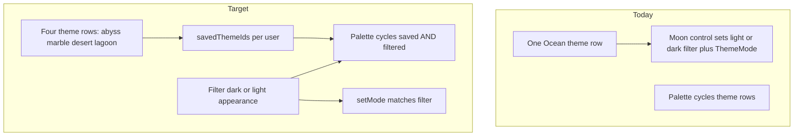

# Skinned library, appearance filter, and Ocean removal

## Goal

- **Four starter skins** (no “Ocean” in UI or slugs): **Abyss** (ex–Ocean dark art/tokens), **Marble** (ex–Ocean light art/tokens), **Desert**, **Lagoon**.
- **Palette control** ([`BgSwitcher`](src/components/layout/bg-switcher.tsx)): cycles only skins that are **saved on the account** and match the **current appearance filter** (`dark` | `light`).
- **Moon / sun control** ([`ThemeSwitcher`](src/components/layout/theme-switcher.tsx)): this is the **light vs dark filter** for which skins appear in the palette cycle (correct vocabulary: **light** and **dark** only). It is **not** a second axis beside the skins; `ThemeMode` stays aligned with this filter so [`themeToVars`](src/themes/theme-utils.ts) applies the right palette.
- **Per-user library**: `savedThemeIds` on [`users`](convex/schema.ts); **default** = all four starters; **future** catalog skins are opt-in via **add** and **removable**. **The four default skins cannot be removed** (for now), guaranteeing at least **one dark** (Abyss) and **three light** starters in every library.

## Decisions (gap fill — confirmed)

| Topic                                 | Decision                                                                                                                                                                                                                                                                                                                                                                                                                                                                             |
| ------------------------------------- | ------------------------------------------------------------------------------------------------------------------------------------------------------------------------------------------------------------------------------------------------------------------------------------------------------------------------------------------------------------------------------------------------------------------------------------------------------------------------------------ |
| **Backfill / migration**              | **Dev-only environment:** re-seed / reset Convex data when schema changes; no separate production migration path required for v1.                                                                                                                                                                                                                                                                                                                                                    |
| **Client persistence for light/dark** | **Reuse** existing `localStorage` key `divedispatch-theme-pref` (same as today) so shell **filter + `ThemeMode`** stay aligned.                                                                                                                                                                                                                                                                                                                                                      |
| **`appearance` source of truth**      | **Convex column** `themes.appearance` — simple queries for `listMySkins` / filtering; keep `config` JSON aligned when writing themes.                                                                                                                                                                                                                                                                                                                                                |
| **Architecture docs**                 | **Same PR** as code: update [`Architecture/design-system-invariants.md`](Architecture/design-system-invariants.md) (or equivalent) where theme/skin is described; **delete or rewrite** inaccurate statements, not only append.                                                                                                                                                                                                                                                      |
| **Client library source**             | **`listMySkins` only** — one auth query returns themes for the user (from `savedThemeIds`) with `appearance`; do not duplicate the library list on `users.me`.                                                                                                                                                                                                                                                                                                                       |
| **Dev users + `savedThemeIds`**       | **Idempotent seed/internal patch:** when themes exist, patch every user with missing/empty `savedThemeIds` to the four starter ids.                                                                                                                                                                                                                                                                                                                                                  |
| **Future skin add/remove UI**         | **Mutations only for v1** — no minimal Account UI required until a store/settings surface exists.                                                                                                                                                                                                                                                                                                                                                                                    |
| **Tests / grep**                      | **Same PR** as the feature — update skin/theme tests and fix CI before merge.                                                                                                                                                                                                                                                                                                                                                                                                        |
| **Default active skin**               | **`lagoon`** — new users, users without `selectedThemeId`, and legacy **`ocean`** migration all resolve to **Lagoon**; default **light** filter / `ThemeMode` so shell matches Lagoon’s `appearance`. User **cycles the palette from Lagoon** (next = next in canonical order within the active filter, e.g. light: Marble → Desert → Lagoon → wrap).                                                                                                                                |
| **Optional polish (accepted)**        | (1) **Single `STARTER_SLUGS` constant** shared by Convex + client for non-removable list, seed order, and canonical cycle order. (2) **Load rule:** on boot, **align `ThemeMode` / filter with the active theme’s `appearance`** from Convex; if `localStorage` conflicts, **theme wins** then persist (avoids flash). (3) **`appearance`** on DB row is enough for queries; **do not require** duplicating `appearance` inside `config` JSON unless offline parity is needed later. |
| **Filter change vs current skin**     | If the user switches light/dark filter and the **active skin is not in the new filtered set** (e.g. Lagoon + switch to **dark**), **auto-apply the first skin in the new filtered list** (Abyss) and sync **`selectTheme` + mode** — do not leave a light skin selected under a dark-only cycle. Symmetric rule when switching **dark → light** (e.g. auto-first in light list, typically **Marble** per canonical order).                                                           |

## Appearance matrix (v1, locked)

| Skin   | `appearance` | Notes                       |
| ------ | ------------ | --------------------------- |
| Abyss  | `dark`       | Only dark-category starter. |
| Marble | `light`      |                             |
| Desert | `light`      |                             |
| Lagoon | `light`      |                             |

Implications: **dark filter** cycles at most **one** starter skin (Abyss) unless more dark skins are added later; **light filter** cycles **three**. Because the four starters **cannot be removed**, empty buckets for v1 should not occur; if starters become removable later, add empty-state UX then.

## Current vs target model

## Data model (Convex)

1. **`themes` table** ([`convex/schema.ts`](convex/schema.ts)) — add:
   - `appearance: v.union(v.literal('dark'), v.literal('light'))` — drives moon filter and default `ThemeMode` when that skin is active.
   - Optional: `isStarter: v.boolean()` (or infer from a constant list of slugs in seed) so new non-starter themes are not auto-added to every user.

2. **`users` table** — add:
   - `savedThemeIds: v.optional(v.array(v.id('themes')))` — ordered list is optional; if order matters for cycle order, document sort rules (e.g. stable slug order in UI).

3. **Queries / mutations** ([`convex/themes.ts`](convex/themes.ts)):
   - **`listMySkins`** (auth): active themes whose `_id` is in `user.savedThemeIds`, return `{ _id, slug, name, appearance, ... }` for the nav.
   - **`addSkinToLibrary` / `removeSkinFromLibrary`**: validate theme exists, `isActive`, and (for add) optionally block premium tiers if you use `tier` later. **`removeSkinFromLibrary`** rejects removal of **starter** slugs (`abyss`, `marble`, `desert`, `lagoon`) until product changes; future non-starter skins remain removable.
   - **`selectTheme`**: keep, but **enforce** `themeId ∈ savedThemeIds` (or auto-add on select — prefer **strict** to match “opt-in” for future skins).
   - **Migration**: one-off internal mutation or seed step: for each user, if `savedThemeIds` missing/empty, set to the four starter theme ids; map legacy **`ocean`** row to **remove** after inserting **abyss** + **marble** (see below).

## Theme configs (client + seed JSON)

1. **Remove Ocean** from [`src/themes/default-themes.ts`](src/themes/default-themes.ts) and [`convex/lib/defaultThemes.ts`](convex/lib/defaultThemes.ts):
   - **`ABYSS_DEFAULT`**: `id`/`slug` `abyss`, name **Abyss**; use former Ocean **dark** palette + `bgImage` currently pointing at Ocean dark asset; `appearance: 'dark'`.
   - **`MARBLE_DEFAULT`**: `id`/`slug` `marble`, name **Marble**; use former Ocean **light** palette + Ocean light asset; `appearance: 'light'`.
   - Keep **Desert** / **Lagoon**; set **`appearance`: `light`** for both (same as Marble).

2. **`ThemeConfig` / theme JSON** ([`src/themes/theme-types.ts`](src/themes/theme-types.ts)):
   - Keep existing `colors.dark` / optional `colors.light` shape for compatibility with [`themeToVars`](src/themes/theme-utils.ts).
   - For **single-appearance** skins, populate the **canonical** palette in the slot that matches `appearance` (and either duplicate minimally in the other slot or leave unused — implementation detail chosen to avoid breaking `themeToVars`).

3. **Assets**: Rename/copy backgrounds to match unique skin names where required (e.g. `public/backgrounds/abyss.jpg`, `marble.jpg` from current `ocean-dark` / `ocean-light` files) and update `bgImage` URLs; remove or stop referencing `ocean-*` filenames in configs.

4. **Exports**: `DEFAULT_THEMES` / `DEFAULT_THEME_CONFIGS` = **four** entries; update tests that iterate skins ([`tests/skin-contrast.test.ts`](tests/skin-contrast.test.ts), [`tests/unit/glassFormulas.test.ts`](tests/unit/glassFormulas.test.ts)).

## Seed and migrations

1. **Idempotent theme seed** ([`convex/seed.ts`](convex/seed.ts)): upsert by slug **abyss**, **marble**, **desert**, **lagoon** (drop **ocean** slug once migrated).
2. **User defaults**: after themes exist, ensure every user gets **`savedThemeIds`** = all four ids (only when field empty).
3. **Selected theme**: users with old `selectedThemeId` pointing at removed **ocean** → set to **Lagoon** (matches default active skin and light-first shell). New users / missing selection → **Lagoon** theme id.

## UI wiring

1. **`BgSwitcher`**: replace hardcoded slug list with **`listMySkins`** + **filter by `appearance` === current filter** + stable sort using shared **`STARTER_SLUGS` / canonical order** (global: `abyss → marble → desert → lagoon`; **within light filter**: `marble → desert → lagoon`). Default selection **Lagoon** — first palette press moves to **next** in that filtered list (e.g. Marble). With non-removable starters, **empty bucket** should not occur for v1; re-evaluate if starters become removable later.
2. **`ThemeSwitcher`**: change from toggling arbitrary mode to toggling **`skinAppearanceFilter`** (`dark` | `light`); on change, `setMode` to match; **if current `selectedTheme` is excluded from the new filter, call `selectTheme(firstInFilteredList)`** (see Decisions: filter mismatch). Reset palette index when filter changes.
3. **`ThemeProvider`** ([`src/themes/theme-provider.tsx`](src/themes/theme-provider.tsx)): when `themeConfig` loads from `getConfig`, ensure **`mode` matches theme `appearance`**; on conflict with `localStorage`, **theme wins** then write back (see optional polish). Client **fallback** cached theme when unauthenticated / no cache: **Lagoon** config (not Ocean/Abyss).
4. **Future “add skin”**: entry point TBD (settings row, theme store modal, etc.) — minimal first version: call **`addSkinToLibrary`** from a dev-only or hidden UI if product surface not ready; otherwise add a small **Account** affordance.

## Additional recommendations (implementation)

1. **Stable cycle order**  
   Maintain **one canonical ordered list of slugs** (e.g. `abyss → marble → desert → lagoon`). Build the palette cycle as: **intersection** of (a) `savedThemeIds`, (b) themes matching the active **light/dark filter**, (c) **preserving** that canonical order. Avoids arbitrary DB order and keeps cycling predictable.

2. **“Add and apply” for future (non-starter) skins**  
   When a user opts into a new skin, prefer a **single user flow** that both **adds** the theme to `savedThemeIds` and **applies** it (`selectTheme`), or run those two steps in one atomic UX action. Reduces “skin not in library” errors if `selectTheme` is strict.

3. **Locked starters and edge cases**  
   Non-removable four starters (already in the plan) **simplifies v1**: no empty dark/light bucket if filter and library disagree. Revisit removal rules when you allow removing starters or when catalog has many optional skins.

## Copy and grep pass

- Remove user-visible “Ocean” strings; update i18n if any keys reference it.
- Remove user-visible **“day” / “night”** strings where they mean theme appearance; use **light** and **dark** consistently (including `ThemeSwitcher` aria-labels and any nav copy).
- Grep for `ocean` slug / filenames and update references ([`src/app/layout.tsx`](src/app/layout.tsx) `data-theme` default → **`lagoon`**, [`globals-theme.css`](src/app/globals-theme.css) fallbacks, etc.).

## Verification

- Unit: theme provider still injects vars; optional small test for “ordered skins by filter”.
- Manual: default shell is **Lagoon** + **light**; palette cycles from there within filter; moon switches filter; new user gets four saved skins with **selected** = Lagoon.

## Remaining minor gaps (implementation notes)

- **Library list:** Use **`listMySkins` only** for nav/cycle — do not duplicate the saved list on `users.me` (see Decisions table).
- **Strict `selectTheme`:** Idempotent **seed/user patch** fills `savedThemeIds` for all dev users (see Decisions table).
- **Future catalog:** v1 ships **mutations only**; optional UI later.
- **Tests:** Update in **same PR** as the feature (see Decisions table).

## Risks / follow-ups

- **Breaking change** for any external doc or Convex data still using `ocean` slug — migration is mandatory.
- **Asymmetric filters**: With only **Abyss** in `dark`, the dark palette cycle has **one** skin until more dark skins exist; UX copy or a second dark skin later may help.
- **Tokens**: No mandatory restructure of token files; verify generated/derived CSS and tests do not hard-code `ocean` or a single theme. Per-skin static CSS generation remains optional.

## Token / CSS note

- **Does this complicate tokens?** Slightly more theme JSON to maintain, but the **injection pipeline** (`themeToVars` + optional derived CSS) stays the same. Risk is **consistency** across four blobs, not a new token algebra.
- **Restructure needed?** Only if audits find **hard-coded** `ocean` or assumptions of one global theme; otherwise update **references** and keep [`src/themes/css-derived-tokens.ts`](src/themes/css-derived-tokens.ts) / generators theme-agnostic where possible.
