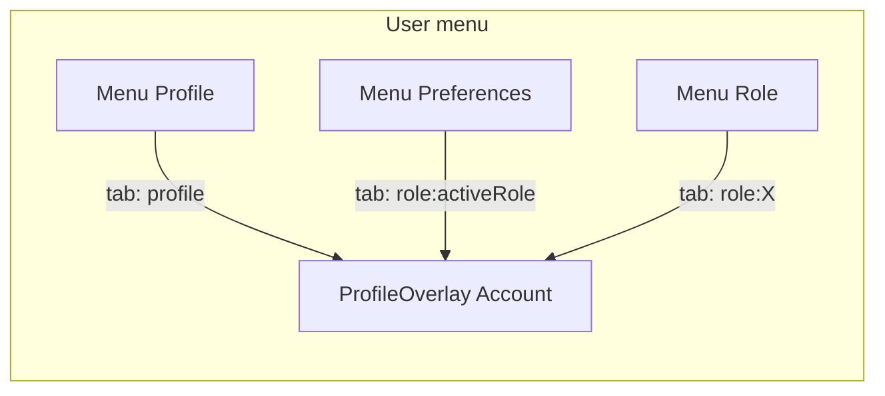

# Account vs Workspace terminology (frontend)

This document inventories how **Account**, **Workspace**, **Preferences**, and related code names appear in DiveDispatch. Use it when changing routes, copy, or components.

**Account** (overlay: Profile + Preferences tabs) is separate from **Workspace** (role route: manage roles, optional embedded profile, equipment inventory, stakeholder preferences editor). The folder **`src/components/account/`** holds shared UI for both flows (tabs, editors, manage roles).

---

## Matrix A — User-visible labels

| Location | Label / copy | What it opens | Key files |
|----------|----------------|---------------|-----------|
| Main navigation (mobile bottom nav) | `nav.dashboard` / `nav.directory` / `nav.workspace` | **`/{slug}/{roleSlug}/workspace`** — Manage Roles, optional embedded profile (resource roles), equipment inventory (equipment role), **PreferencesEditor** | [`src/lib/nav-items.ts`](../src/lib/nav-items.ts), [`src/app/(dashboard)/[slug]/[roleSlug]/workspace/page.tsx`](../src/app/(dashboard)/[slug]/[roleSlug]/workspace/page.tsx), [`src/components/layout/mobile-bottom-nav.tsx`](../src/components/layout/mobile-bottom-nav.tsx) |
| User menu (avatar) | `userMenu.preferences`, `nav.signOut`, profile entry | **Preferences** opens **`ProfileOverlay`** on tab **`preferences`** → [`PreferencesTab`](../src/components/account/preferences-tab.tsx) | [`src/components/layout/user-menu.tsx`](../src/components/layout/user-menu.tsx) |
| Profile overlay dialog | `accountOverlay.title` (e.g. “Account”); tabs `nav.profile` / `nav.preferences` | Tab ids **`profile`** vs **`preferences`** | [`src/components/profiles/profile-overlay.tsx`](../src/components/profiles/profile-overlay.tsx) |
| Workspace page frame | Page title `nav.workspace` | Role **Workspace** surface (prefs + roles + conditional profile embed) | [`workspace/page.tsx`](../src/app/(dashboard)/[slug]/[roleSlug]/workspace/page.tsx) |
| Directory stakeholder card | Link label varies | URL **`/{prefix}/{slug}/workspace`** | [`src/components/directory/stakeholder-card.tsx`](../src/components/directory/stakeholder-card.tsx) |
| Profile completion banner CTA | — | Prop **`workspaceHref`**: operators → **`.../profile`**; resource roles → **`.../workspace`** | [`src/components/profiles/profile-completion-banner.tsx`](../src/components/profiles/profile-completion-banner.tsx) |
| Vessel calendar empty state | “Set up your fleet in Workspace.” | Boat fleet setup | [`src/components/booking/vessel-calendar.tsx`](../src/components/booking/vessel-calendar.tsx) |
| Legacy URL | — | **`/{slug}/{roleSlug}/settings`** → **308** to **`.../workspace`** ([`src/proxy.ts`](../src/proxy.ts)) | — |

### Related (not the Workspace route)

| Location | Label | Notes |
|----------|--------|--------|
| Account page (`/account`) | “Account” | [`AccountForm`](../src/components/account/account-form.tsx) | [`src/app/(dashboard)/account/page.tsx`](../src/app/(dashboard)/account/page.tsx) |
| Role profile page | “Profile” **`/{slug}/{roleSlug}/profile`** | Section tabs use **`ProfileSectionTabBar`** | [`profile/page.tsx`](../src/app/(dashboard)/[slug]/[roleSlug]/profile/page.tsx) |

---

## Matrix B — Code names (developers)

| Name | Role | Files |
|------|------|--------|
| `components/account/` | Shared UI: account form, profile/preferences tabs, **PreferencesEditor**, **ManageRoles**, **ProfileSectionTabBar** | [`src/components/account/`](../src/components/account/) |
| `ProfileSectionTabBar` | ARIA tab list — Profile page sections, **PreferencesEditor**, overlay | [`src/components/account/profile-section-tab-bar.tsx`](../src/components/account/profile-section-tab-bar.tsx) |
| `ProfileOverlayTab` | `'profile' \| 'roles' \| \`role:${RoleKey}\`` | [`src/components/profiles/profile-overlay.tsx`](../src/components/profiles/profile-overlay.tsx) |

---

## Matrix C — Backend / completeness (not a page)

| Term | Meaning | Files |
|------|---------|--------|
| `SETTINGS_REQUIRED` | **`users` table** fields (e.g. `appLanguage`) counted in completeness — naming is historical; concept is **user account fields on `users`** | [`convex/lib/profileCompleteness.ts`](../convex/lib/profileCompleteness.ts), [`convex/lib/requiredFields.ts`](../convex/lib/requiredFields.ts) |

---

## User flows

---

## Related

- Product domain reference: [`DOMAIN_KNOWLEDGE.md`](DOMAIN_KNOWLEDGE.md)
