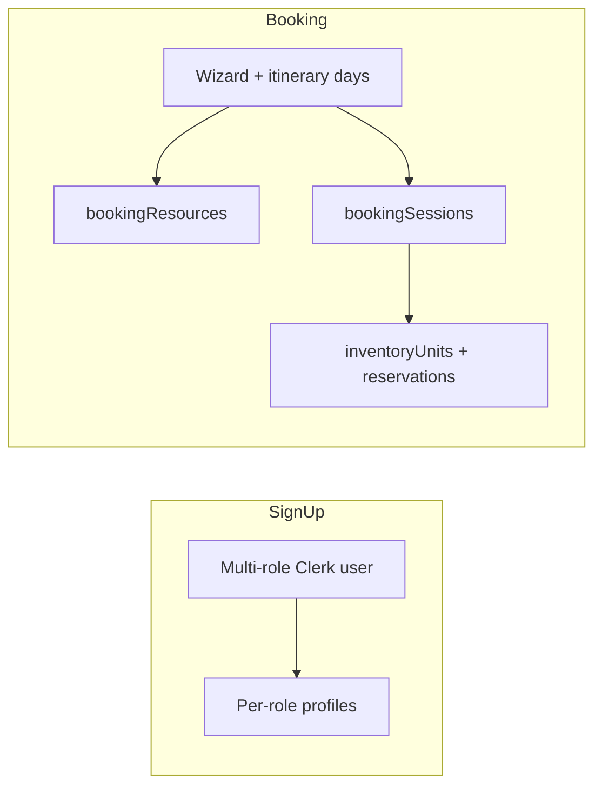

# Stakeholder signup, configuration, and booking flows — code-backed answers

> **Purpose:** Implementation truth for common product questions: what the codebase supports today, what is partial or display-only, and what is not modeled (e.g. hourly pool throughput).  
> **Not:** Marketing copy; see [DOMAIN_KNOWLEDGE.md](DOMAIN_KNOWLEDGE.md) for domain “why.”

---

## Sign-up and roles

### Can every stakeholder sign up and become part of a booking?

**Partially.** Sign-up supports selecting multiple Clerk roles and creating a Convex user ([sign-up page](../src/app/(auth)/sign-up/[[...sign-up]]/page.tsx)). Roles are defined in [`src/lib/constants/roles.ts`](../src/lib/constants/roles.ts). A stakeholder is “on” a booking when the operator assigns them via `bookingResources` and sessions/reservations—not automatically for all role types. The **customer** joins through a tokenized portal link (auth boundary in [CLAUDE.md](../CLAUDE.md)), not the same sign-up flow.

### Can I sign up as a dive center with two boats, a pool, equipment manager, and a compressor?

**Mostly yes in principle:** you can select multiple roles at sign-up (including `DiveCenter`, `Boat`, `Pool`, `Equipment`, `Compressor`). Each role has its own profile table in [`convex/schema.ts`](../convex/schema.ts): `diveCenters`, `boats`, `venues` (pools), `equipment`, `compressors`. **Two boats** are modeled as a **fleet array** on the **Boat** stakeholder profile (`boats.fleet[]` with `maxPax` per vessel), not as rows on `diveCenters`. The dive center record itself does not own a fleet; capacity for scheduling comes from **inventory units** seeded or created per resource (see [`convex/seed.ts`](../convex/seed.ts) `seedResourceInventory`).

### Can I declare equipment types and counts per size?

**Yes at the data layer.** `equipmentInventory` rows tie to `inventoryUnits` with `gearType`, `size`, optional `manufacturer` ([`convex/schema.ts`](../convex/schema.ts), equipment tables). Pooled counts are represented via `inventoryUnits.totalUnits` and availability snapshots.

### Can I declare pool depth and occupants per hour?

**Depth: yes (`venues.maxDepth`). Hourly throughput: no dedicated field.** Venues support `maxDepth` and `maxCapacity` ([`convex/schema.ts`](../convex/schema.ts)). Pool capacity for scheduling uses **pooled** `inventoryUnits.totalUnits` (see seed: pool unit uses `maxCapacity`). There is **no** schema field for “occupants per hour” as a rate limit.

### Can I declare maximum capacity for each boat?

**Yes** — each fleet entry has `maxPax` (and optional `seatCapacity`) on `boats.fleet[]` ([`convex/schema.ts`](../convex/schema.ts)); inventory units use `totalUnits` per vessel for pooled availability.

---

## Dive center dashboard: Quick Book and drag-to-calendar

### On my dive center dashboard, can I use a Quick Book pill and drag it onto the calendar to start a booking?

**Yes for organizer dashboards** (e.g. Dive Center). [`DashboardContent`](../src/components/layout/dashboard-content.tsx) renders `QuickBookRail` with `dragEnabled={isOrganizer}` and `BookingCalendar` with `droppableEnabled={isOrganizer}`. Drag handlers live in [`use-booking-dnd.ts`](../src/lib/hooks/use-booking-dnd.ts) (source type `quick-book-pill`, target `calendar-date`). **Boat-only** dashboards swap in `VesselCalendar` and do **not** use this rail/calendar combo.

### If I use the O+A pill and drop it on April 10th, will the booking be pre-populated with all of my preferences?

**Partial.** Drop calls `buildPreFill` ([`compute-date-range.ts`](../src/lib/booking/compute-date-range.ts)), which sets **date range** (O+A combo via [`calculateComboDates`](../src/lib/booking/course-validation.ts) / [`computeDateRange`](../src/lib/booking/compute-date-range.ts)), **agency**, and the **first** preferred slug for instructor, venue, boat, equipment, compressor from [`useOperatorDefaults`](../src/lib/hooks/use-operator-defaults.ts) (arrays from `stakeholderPreferences` + primary agency from DC/agent profile). It does **not** merge every template field or every day-level nuance automatically—you still complete the wizard (itinerary/resources).

### Does it know who my preferred stakeholders are because I filled them out before I can make a booking?

**Yes** — defaults come from `stakeholderPreferences` (`preferredInstructorSlugs`, `preferredVenueSlugs`, `preferredBoatSlugs`, etc.) and feed `buildPreFill` ([`use-operator-defaults.ts`](../src/lib/hooks/use-operator-defaults.ts)). Directory also sorts preferred instructors when listing ([`convex/directory.ts`](../convex/directory.ts) `listByRole` for `Instructor`).

---

## Itinerary: pool first day, different boats by day, instructor logic

### Does it know that on the first day I do config only in my own pool? Can I select different boats on different days for different locations?

**Supported in the itinerary model** as **per-day** pool/boat/shore choices: [`ItineraryStep`](../src/components/booking/itinerary-step.tsx) maps **each day** to `DayRow` with `poolOptions`, `boatOptions`, etc. Course/day generation (O+A, OW, confined vs open water) is driven by catalog and wizard rules—**first-day confined/pool-heavy** schedules are a **consequence of course structure and user schedule**, not a single automatic “config only day 1” rule without going through the wizard.

### Is my preferred instructor auto-filtered based on matching languages with the customer and availability of the instructor?

**Tiered ordering + availability filter, not auto-pick.** Instructors are filtered with [`filterByAvailability`](../src/lib/booking/availability-filter.ts) per day. When customer language codes exist, [`GlassSelect`](../src/components/ui/glass-select.tsx) uses [`splitInstructorTiers`](../src/lib/booking/instructor-tiers.ts) (language match + preferred). The user **still selects** an instructor; the UI prioritizes matches.

### Are dive masters automatically filtered out because they cannot teach courses?

**Effectively yes for instructor pickers:** the itinerary loads `api.directory.listByRole({ role: 'Instructor' })` only ([`itinerary-step.tsx`](../src/components/booking/itinerary-step.tsx)). Dive masters are a **separate** role (`DiveMaster`) and are not returned as instructors in that list.

---

## Pending acceptance, calendar visibility, status

### If the instructor does not auto-accept bookings, do they see a pending booking on their calendar? If they accept, does it add to their calendar?

**Pending requests:** Reservations are `Confirmed` vs `PendingAcceptance` based on `isAutoAccept` in [`convex/bookings/create.ts`](../convex/bookings/create.ts) (`acceptanceMode === 'Auto'` **or** self-booking **or** missing owner user). Non-auto yields `PendingAcceptance`. Resource stakeholders see **Pending** items in [`PendingRequestsList`](../src/components/booking/pending-requests-list.tsx) fed by `_myDashboard` in [`convex/bookings.ts`](../convex/bookings.ts) (queries `PendingAcceptance` on the caller’s inventory units). **Accept** uses [`acceptByBookingForCaller`](../convex/reservationsMutations.ts).

**Calendar:** Bookings appear via `resolveCallerBookings` + `bookingResources` for resource roles ([`convex/bookings.ts`](../convex/bookings.ts)). Draft/Upcoming/Completed are shown per filtered list; reservation status can annotate display (`reservationStatus` on calendar rows for resource-only views). Exact **legend/color** for “pending vs confirmed” depends on [`deriveStatus`](../src/lib/utils/calendar-range.ts) and draft urgency flags.

### Do all stakeholders see this booking on their calendar?

**Those assigned to the booking** (via `bookingResources` / relevant queries) see it when they use a role that resolves those bookings ([`resolveCallerBookings`](../convex/bookings.ts)). **Unassigned** stakeholders do not. The **operator** sees owned bookings (`listByOwner`). **Customers** use the portal, not this dashboard calendar.

### As the day becomes the start date, does the status change from Upcoming to Active?

**Display only.** [`deriveStatus`](../src/lib/utils/calendar-range.ts) returns `'Active'` when `status === 'Upcoming'` and `startDate <= todayStr`. The **database status stays `Upcoming`** until completion logic runs; tests state the DB remains `Upcoming` on the activity day ([`tests/bookingLifecycle.test.ts`](../tests/bookingLifecycle.test.ts), “4a — backend stays Upcoming on activity day”). Completion to `Completed` is driven by session end + cron ([`convex/bookings/status.ts`](../convex/bookings/status.ts) `completeBookings`), not by storing an “Active” status.

---

## Architecture snapshot

---

## Summary table

| Topic | Verdict |
| --- | --- |
| Multi-stakeholder signup | Yes (multi-role); joining a booking is assignment + portal for customers |
| One identity: DC + 2 boats + pool + equipment + compressor | Yes via multiple roles; boats = `boats.fleet[]` |
| Equipment by type/size/count | Yes (`equipmentInventory` + `inventoryUnits`) |
| Pool depth + hourly occupants | Depth/capacity yes; **no hourly rate field** |
| Boat max capacity | Yes (`maxPax` / inventory) |
| Quick Book drag on DC calendar | Yes |
| O+A drop pre-fills | Date range + agency + first preferred slugs—not “everything” |
| Preferred stakeholders | Yes via `stakeholderPreferences` |
| Per-day pool vs different boats | Yes in itinerary |
| Instructor tiers + availability | Tiering + filters; not auto-assign |
| Dive masters teaching courses | Not in Instructor directory list |
| Non-auto-accept | `PendingAcceptance` + pending list; accept confirms reservations |
| All stakeholders’ calendars | Only if assigned / role query includes booking |
| Upcoming → Active | **Calendar display**; DB stays `Upcoming` until completed |
